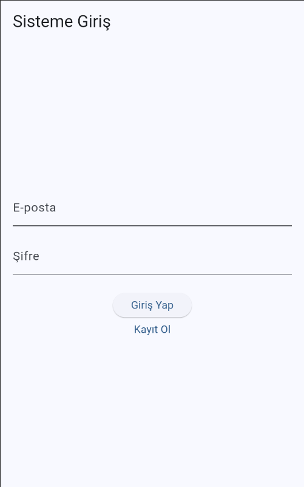
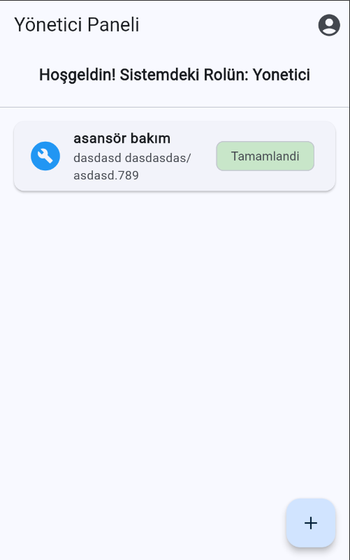
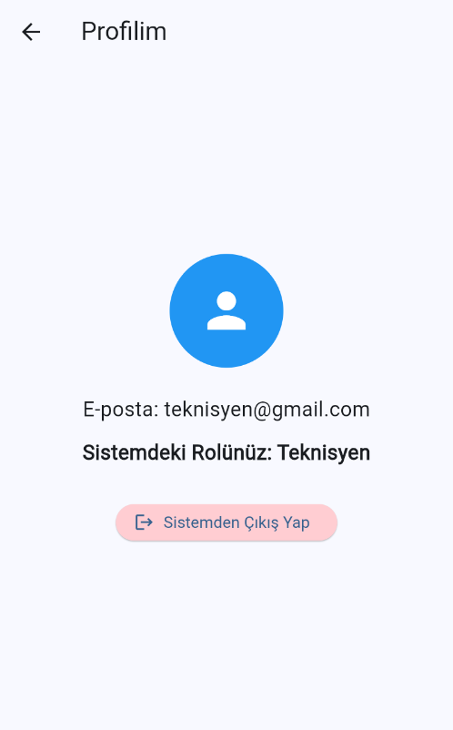

# Periyodik Kontrol ve Hizmet Takip Sistemi

Supabase kullanılarak Rol tabanlı (Yönetici / Teknisyen) periyodik hizmet takip sistemi oluşturulmuştur.

## Öğrenci Bilgileri
* **Ad Soyad:** Enes Buğra Kaynakoğlu
* **Öğrenci No:** 243301130

## Test Hesapları (Supabase Auth)
Test Hesapları ;

**Yönetici (Admin) Hesabı:**
* E-posta: admin@gmail.com  
* Şifre: 123456 
* *Not: Sadece yöneticiler sisteme yeni periyodik kontrol görevi ekleyebilir.*

**Teknisyen Hesabı:**
* E-posta: teknisyen@gmail.com 
* Şifre: 123456 
* *Not: Teknisyenler sadece listeyi görür görevleri detay sayfasından tamamlandı olarak işaretleyebilir.*

## Kullanılan Temel Paketler
* `supabase_flutter`: Veritabanı ve kimlik doğrulama işlemleri için.
* `flutter/material.dart`: UI bileşenleri için.

## Ekran Görüntüleri

1. Giriş/Kayıt Ekranı
   

2. Ana Liste (Yönetici Paneli)
   

3.  Profil Ekranı
   